# M5Stack-BME280-ESPNOW 生徒向け使い方ガイド

このガイドは、**Arduinoを触ったことがない人**向けに、lesson1からlesson7までの学習用コードの使い方を詳しく説明します。

## 📚 目次

1. [1. 必要な環境の準備](#1-必要な環境の準備)
2. [2. センサーと通信方式について](#2-センサーと通信方式について)
3. [3. lesson1: センサーを使う](#3-lesson1-センサーを使う)
4. [4. lesson2: マイコンのUI作成](#4-lesson2-マイコンのui作成)
5. [5. lesson3: 無線通信をする（ESP-NOW）](#5-lesson3-無線通信をするesp-now)
6. [6. lesson4: マイコンのUI作成（M5Stack側）](#6-lesson4-マイコンのui作成m5stack側)
7. [7. lesson5: PCとの接続（Python）](#7-lesson5-pcとの接続python)
8. [8. lesson6: PythonでUIを作成](#8-lesson6-pythonでuiを作成)
9. [9. lesson7: 参加者で共同作品](#9-lesson7-参加者で共同作品)
10. [10. 発展編](#10-発展編)
11. [よくあるエラーと解決方法](#よくあるエラーと解決方法)

---

## 1. 必要な環境の準備

### 1.1. 準備するハードウェア

- **Groveコネクター**
- **BME280**
- **M5StickC Plus**
- **M5Stack**
- **USB Type-C ケーブル**


### 1.2. 準備するソフトウェア

- **Arduino IDE**（マイコン用にプログラムを作成するのに使用）
- **Visual Studio Code (VSCode)**（Pythonのプログラムを動かすのに使用）


### 1.3. 準備するプログラム

このプロジェクトで使用するプログラムファイルをGitHubからダウンロードして準備します。

**ステップ1: GitHubリポジトリからzipファイルをダウンロード**

1. ブラウザで [https://github.com/sassa4771/M5Stack-BME280-ESPNOW](https://github.com/sassa4771/M5Stack-BME280-ESPNOW) を開く
2. **Code**ボタンをクリック
3. **Download ZIP**を選択してzipファイルをダウンロード

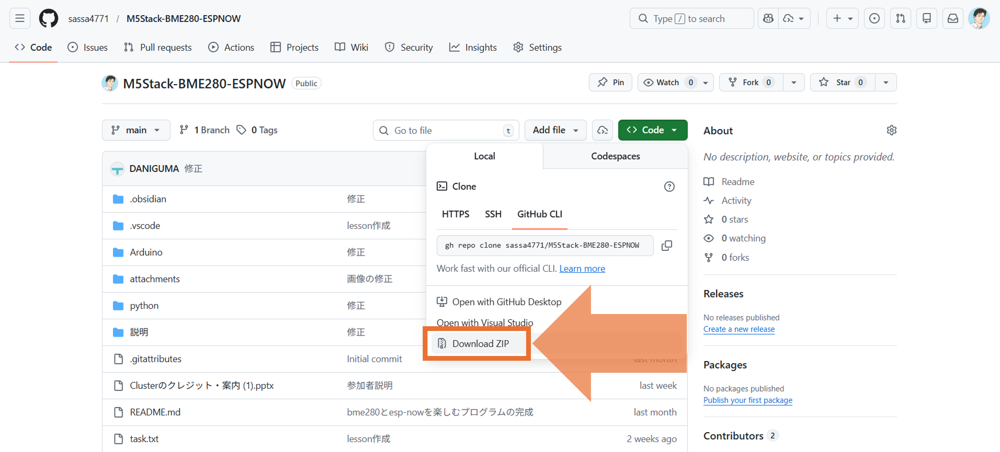

**ステップ2: zipファイルを展開**

1. ダウンロードしたzipファイル（`M5Stack-BME280-ESPNOW-main.zip`など）をデスクトップに移動
2. zipファイルを右クリックして「すべて展開」または「展開」を選択
3. 展開先をデスクトップに指定して展開
4. デスクトップに`M5Stack-BME280-ESPNOW-main`フォルダが作成されます


> [!TIP]
> 展開後のフォルダ名は、必要に応じて`M5Stack-BME280-ESPNOW`などに変更しても構いません。

## 2. Arduino IDEの設定

### 2.1. Arduino IDEのインストール

1. [Arduino IDE公式サイト](https://www.arduino.cc/en/software)からダウンロード
2. インストーラーを実行してインストール
3. Arduino IDEを起動

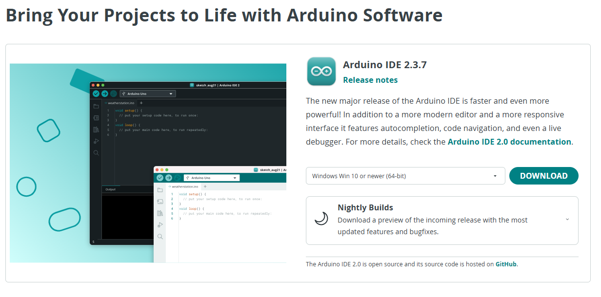

> [!TIP]
> 画像のようにSoftware Updateが表示される場合、更新の必要がない場合は「NOT NOW」を押してください。
> 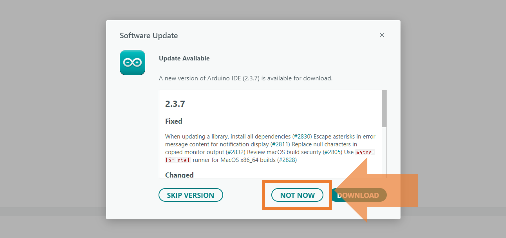

### 2.2. ESP32ボードの追加

Arduino IDEには最初からESP32の設定が入っていないので、追加する必要があります。

**ステップ1: 環境設定を開く**

1. Arduino IDEを開く
2. **ファイル > 基本設定**をクリック

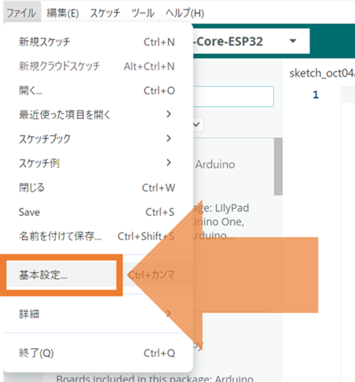
- 説明: Arduino IDEの環境設定画面
- 「追加のボードマネージャーのURL」の欄が表示されている

**ステップ2: ボードマネージャーのURLを追加**

3. **矢印の箇所をクリックして追加のボードマネージャーのURL**の欄に以下を追加：
```
https://static-cdn.m5stack.com/resource/arduino/package_m5stack_index.json

https://raw.githubusercontent.com/espressif/arduino-esp32/gh-pages/package_esp32_index.json
```

4. **OK**をクリック

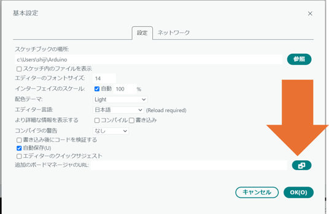

**ステップ3: ボードマネージャーを開く**


5. **ツール > ボード > ボードマネージャー**を開く

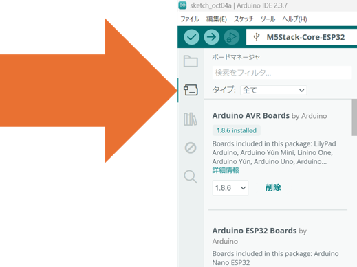

**ステップ4: ESP32とM5Stackをインストール**

6. 検索欄に「**ESP32**」と入力
7. 「**esp32 by Espressif Systems**」を探して、**バージョン2.0.1**(最新バージョンでないので注意)を選択して**インストール**をクリック
8. インストールが完了するまで待つ（数分かかります）
9. 検索欄に「**M5Stack**」と入力
10. 「M5Stack」を探して、バージョン3.2.5を選択してインストールをクリック
11. インストールが完了するまで待つ（数分かかります）

> [!IMPORTANT]
> 写真の位置に「esp32」「M5Stack」があれば正しくインストールできています。

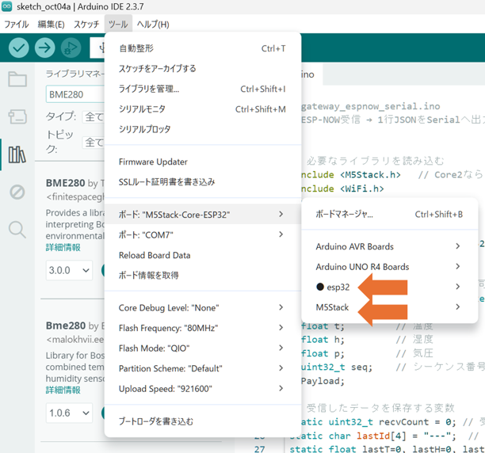

### 2.3. ライブラリのインストール

以下のライブラリをインストールします：

1. **ツール > ライブラリを管理**を開く

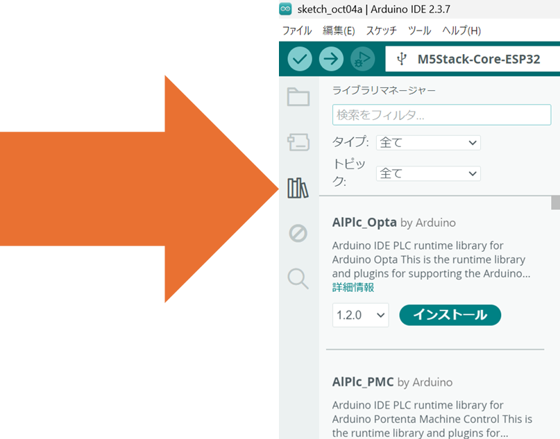

2. 検索欄にライブラリ名を入力して、それぞれインストール：

   **M5StickCPlus**（M5StickC Plus用）
   - 検索: 「M5StickCPlus」
   - 「M5StickCPlus by M5Stack」バージョン0.1.1をインストール
   - InstallAllを選択

   **M5Stack**（M5Stack用）
   - 検索: 「M5Stack」
   - 「M5Stack by M5Stack」バージョン0.4.6をインストール

   **Adafruit BME280 Library**
   - 検索: 「BME280」
   - 「Adafruit BME280 Library by Adafruit」バージョン2.3.0をインストール
   - インストール時に依存ライブラリ（Adafruit Unified Sensor）も一緒にインストールされます

### 2.4. USBドライバのインストール

1. https://docs.m5stack.com/en/download このサイトからCP210x_VCP_Windows をダウンロードして展開
2. CP210xVCPInstaller_x64_v6.7.0.0.exeというファイルを実行してドライバーのインストール
   - インストール後、PCを再起動することを推奨します

# 3. Python環境の準備 (Visual Studio Code)

## 3.1. Visual Studio Codeのインストール

1. [Visual Studio Code公式サイト](https://code.visualstudio.com/)からダウンロード
2. インストーラーを実行してインストール
3. Visual Studio Codeを起動

## 3.2. プロジェクトフォルダを開く

1. Visual Studio Codeを起動したら、**ファイル > フォルダーを開く**をクリック
2. [1.3. 準備するプログラム](#13-準備するプログラム)でダウンロード・展開したフォルダ内の`python`フォルダを選択
3. **フォルダーの選択**をクリック

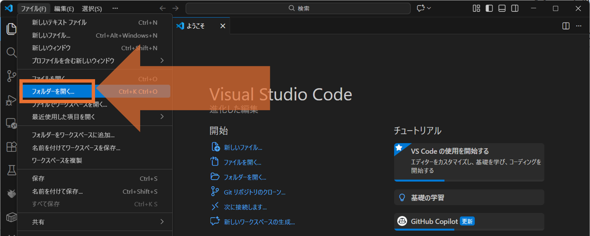

> [!TIP]
> フォルダのパス例: `デスクトップ\M5Stack-BME280-ESPNOW-main\python`


## 2.5. Pythonのインストール

1. [Python公式サイト](https://www.python.org/downloads/)からPython 3.7以上をダウンロード・インストール
2. インストール時に「Add Python to PATH」にチェックを入れることを推奨します

## 2.6. 必要なライブラリのインストール

### ステップ1: VSCodeでターミナルを開く

VSCodeでターミナルを開く方法は3つあります：

**方法1: メニューから開く**
- **ターミナル > 新しいターミナル** をクリック

**方法2: ショートカットキーを使う**
- Windows: `Ctrl + Shift + @`（日本語キーボードでは `Ctrl + Shift + @`）
- Mac: `Cmd + Shift + @`

**方法3: 画面上部のアイコンから開く**

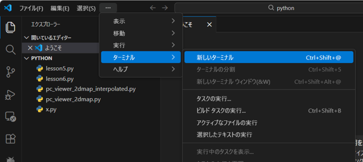

ターミナルが開くと、VSCodeの下部にコマンド入力エリアが表示されます。

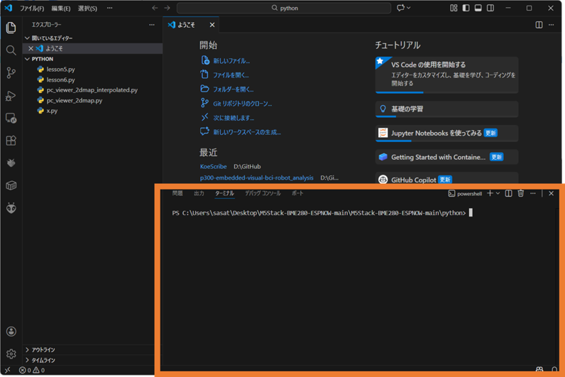

### ステップ2: ライブラリをインストール

ターミナルで以下のコマンドを実行してライブラリをインストール：
   ```bash
   pip install pyserial matplotlib numpy scipy
   ```

---

### 2.7. Arduino IDEの基本操作

#### Arduino IDEとは？

**Arduino IDE**は、ArduinoやESP32などのマイコンにプログラムを書き込むためのソフトウェアです。無料でダウンロードできます。

#### 基本的な用語

- **スケッチ（Sketch）**: Arduinoのプログラムファイルのこと
- **コンパイル（Compile）**: プログラムをマイコンが理解できる形式に変換すること
- **アップロード（Upload）**: コンパイルしたプログラムをマイコンに書き込むこと
- **シリアルモニター**: マイコンとPCの間でデータをやり取りするための画面

#### Arduino IDEの画面構成
Arduino IDEを開くと、以下のような画面が表示されます：

  - メニューバー（ファイル、編集、スケッチ、ツールなど）
  - コードエディタ（中央の白い部分）
  - ツールバー（コンパイル、アップロードボタン）
  - メッセージエリア（下部の黒い部分）

#### 基本的な操作

1. **ファイルを開く**: `ファイル > 開く` または `Ctrl+O`（Windows）/ `Cmd+O`（Mac）
2. **コンパイル**: `スケッチ > 検証/コンパイル` または `Ctrl+R`（Windows）/ `Cmd+R`（Mac）
3. **アップロード**: `スケッチ > アップロード` または `Ctrl+U`（Windows）/ `Cmd+U`（Mac）
4. **シリアルモニターを開く**: `ツール > シリアルモニター` または `Ctrl+Shift+M`（Windows）/ `Cmd+Shift+M`（Mac）

## 3. センサーと通信方式について

このセクションでは、このプロジェクトで使用するセンサーと通信方式について説明します。初心者の方でも理解できるよう、専門用語を避けてわかりやすく説明します。

### 3.1. BME280センサーとは？

**BME280**は、温度・湿度・気圧を同時に測定できる環境センサーです。
BME280はかなり有名なセンサーで、いろんなボードがあります。


**複数あるってことは、BME280にも種類がいくつかあるってこと？**

いいえ、BME280センサーはどこのメーカーも同じものを使っています。
ボードは複数ありますが、使っているセンサーはみな一緒です（下のやつがBME280）


> [!NOTE]
> 参考：BME280データシート
> [https://raw.githubusercontent.com/SeeedDocument/Grove-Barometer_Sensor-BME280/master/res/Grove-Barometer_Sensor-BME280-.pdf](https://raw.githubusercontent.com/SeeedDocument/Grove-Barometer_Sensor-BME280/master/res/Grove-Barometer_Sensor-BME280-.pdf)

#### 測定できるもの

- **温度（Temperature）**: 周囲の温度を摂氏（°C）で測定します
  - 例: 25.30°C（室温程度）
- **湿度（Humidity）**: 空気中の水分量をパーセント（%RH）で測定します
  - 例: 55.20%RH（快適な湿度）
- **気圧（Pressure）**: 大気圧をヘクトパスカル（hPa）で測定します
  - 例: 1013.25hPa（標準的な気圧）

#### なぜBME280を使うの？

- **1つのセンサーで3つのデータ**が取得できるため、配線が簡単です
- **精度が高い**ため、正確な測定ができます
- **小型で安価**なため、学習用に最適です


### 3.2. I2C通信とは？

**I2C（アイ・スクエア・シー）**は、センサーとマイコンを接続するための通信方式です。

#### なぜI2Cを使うの？

- **配線が少ない**: データ線（SDA）とクロック線（SCL）の2本だけで複数のセンサーと接続できます
- **簡単**: 複雑な設定が不要で、初心者でも扱いやすいです
- **標準的**: 多くのセンサーがI2Cに対応しています

#### I2Cの接続方法

BME280とM5StickC Plusを接続する場合：

```
BME280          M5StickC Plus
─────────────────────────────
VCC  ──────────> 3.3V（電源）
GND  ──────────> GND（接地）
SDA  ──────────> GPIO 32（データ線）
SCL  ──────────> GPIO 33（クロック線）
```


#### I2Cアドレスとは？

I2Cで接続されたセンサーには、それぞれ**アドレス**（番地のようなもの）が割り当てられています。

- BME280のデフォルトアドレス: **0x76**（16進数）
- もし0x76で見つからない場合は、**0x77**を試してみてください

コードでは以下のように指定します：
```c
bme.begin(0x76, &Wire);  // 0x76はI2Cアドレス
```

### 3.3. ESP-NOW通信とは？

**ESP-NOW**は、ESP32マイコン専用の無線通信プロトコルです。

#### なぜESP-NOWを使うの？

- **Wi-Fi不要**: ルーターやアクセスポイントがなくても通信できます
- **低消費電力**: Wi-Fiより省エネで、バッテリー駆動に適しています
- **高速**: データの送受信が速いです
- **簡単**: 複雑な設定が不要で、コードがシンプルです

#### ESP-NOWの仕組み

1. **送信側（M5StickC Plus）**: センサーデータを取得して、無線で送信します
2. **受信側（M5Stack）**: 送信されたデータを受信して、シリアルポートに出力します

#### 通信に必要な設定

- **チャンネル（CHANNEL）**: 無線の周波数帯域。送信側と受信側で**同じチャンネル**に設定する必要があります
  - 例: `CHANNEL = 1`
- **MACアドレス**: 各デバイスに割り当てられた固有の識別番号です。これで通信するデバイスを指定します。デバイスの名前のようなものです。
  - 例: `98:f4:ab:6c:e7:88`
  - 送信側は、受信側のMACアドレスを指定する必要があります


### 3.4. シリアル(UART)通信とは？

**シリアル通信**は、マイコンとPCの間でデータをやり取りする方法です。

#### なぜシリアル通信を使うの？

- **デバッグに便利**: プログラムの動作を確認できます
- **データ取得**: センサーデータをPCで処理できます
- **標準的**: ほとんどのマイコンが対応しています

#### シリアル通信の設定

- **ボーレート（Baud Rate）**: データの送信速度
  - このプロジェクトでは **115200** を使用します
  - 送信側と受信側で**同じボーレート**に設定する必要があります

#### シリアルモニターとは？

Arduino IDEの**シリアルモニター**は、マイコンから送られてくるデータを表示する画面です。

- マイコンが送信したデータ（文字や数字）がリアルタイムで表示されます
- デバッグやデータ確認に便利です

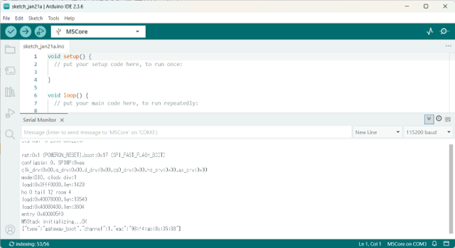

### 3.5. 通信方式のまとめ

このプロジェクトでは、以下の3つの通信方式を使用します：

| 通信方式 | 用途 | 使用するレッスン |
|---------|------|-----------------|
| **I2C** | BME280センサーとマイコンの接続 | lesson1-7 |
| **ESP-NOW** | M5StickC PlusとM5Stackの無線通信 | lesson3-7 |
| **シリアル通信** | M5StackとPCのデータ通信 | lesson5-7 |

> [!TIP] 
> よくある質問
>
> **Q: I2CとESP-NOWの違いは？**
> A: 
> - **I2C**: 有線で、センサーとマイコンを直接接続します（数cm程度の距離）
> - **ESP-NOW**: 無線で、マイコン同士を接続します（10-50m程度の距離）
> 
> **Q: なぜ複数の通信方式を使うの？**
> 
> A: それぞれの通信方式には得意な用途があります：
> - I2C: センサーとの接続に最適
> - ESP-NOW: 無線通信に最適
> - シリアル通信: PCとの接続に最適
> 
> **Q: 通信がうまくいかない場合は？**
> 
> A: [よくあるエラーと解決方法](#よくあるエラーと解決方法)のセクションを確認してください。

---

## 3. lesson1: センサーを使う

### 3.1. このレッスンで学ぶこと

M5StickCとBME280センサーを使って、温度・湿度・気圧を計測し、画面に表示します。

### 3.2. 準備するもの

- M5StickC Plus
- BME280センサー
- USBケーブル


### 3.3. セットアップ手順

#### 3.3.1. ステップ0: ハードウェアの接続

1. M5StickC PlusとBME280センサーを**Groveコネクター**で接続します
   - BME280のGroveコネクターをM5StickC PlusのGroveポート（側面）に差し込みます
   - カチッと音がするまでしっかりと差し込んでください

#### 3.3.2. ステップ1: ファイルを開く

1. Arduino IDEを開く
2. **ファイル > 開く**をクリック
3. プロジェクトフォルダの`Arduino/lesson/lesson1/lesson1_M5StickC.ino`を選択
4. ファイルが開きます

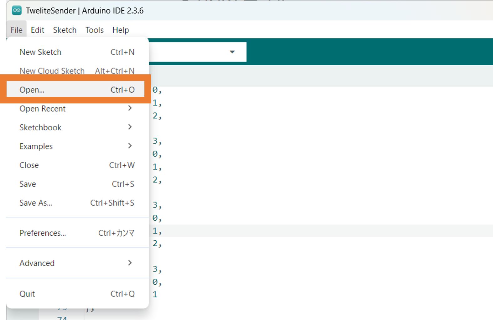

#### 3.3.3. ステップ2: ボードを選択
1. **ツール > ボード**をクリック
2. **M5Stack>M5StickCPlus**を選択

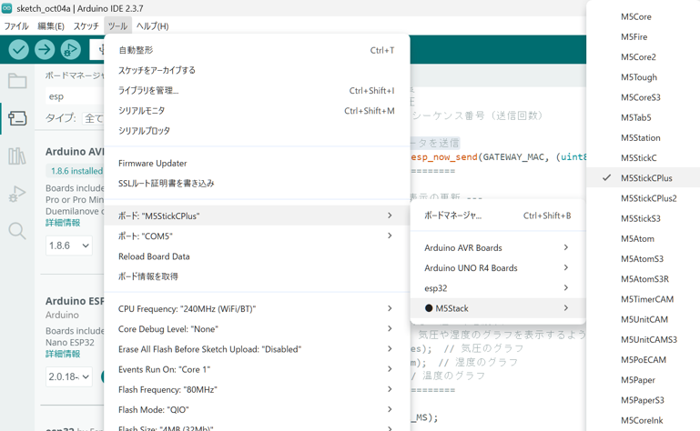

#### 3.3.4. ステップ3: シリアルポートを選択

1. M5StickC PlusをUSBケーブルでPCに接続
2. **ツール > シリアルポート**をクリック
3. 表示されたシリアルポートを選択
   - Windowsの場合: `COM3`、`COM5`など（※PCによって異なるため注意！）
   - Macの場合: `/dev/cu.usbserial-xxxx`など
   - 複数ある場合は、接続したばかりのものを選択


#### 3.3.5. ステップ4: コンパイルとアップロード（書き込み）

1. ツールバーの**検証ボタン**（✓マーク）をクリックしてコンパイル
   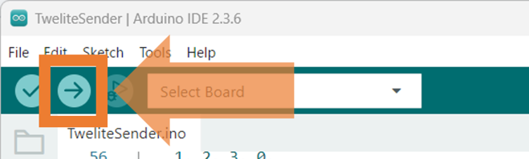
   - マイコンとの接続なしでプログラムがコンパイルできるか確認できます
   - 画面下部に「コンパイルが完了しました」と表示されればOK
   - エラーが出た場合は、[よくあるエラーと解決方法](#よくあるエラーと解決方法)を確認してください

2. ツールバーの**アップロードボタン**（→マーク）をクリック
   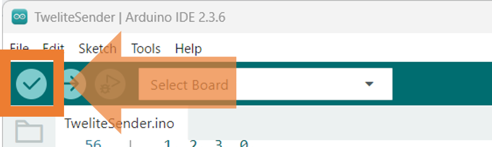
   - アップロードには時間がかかります（約30秒程度かかりますので、しばらくお待ちください）
   - アップロード中はM5StickC Plusの画面に「Uploading...」と表示される場合があります
   - 完了すると「アップロードが完了しました」と表示されます

#### 3.3.6. ステップ5: 動作確認

1. M5StickC Plusの画面を確認
2. 温度・湿度・気圧が表示されていれば成功です！
3. 1秒ごとに値が更新されます


**作成結果**
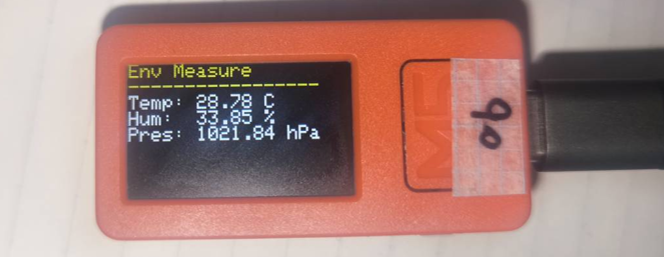

> [!IMPORTANT]
> 実際にセンサーを指で触って温度変化があるか確認しよう！

#### 3.3.7. 電源のオンオフ

M5StickC Plusには**電源ボタン**が搭載されています。このボタンを使って、デバイスの電源をオン/オフしたり、プログラムを再起動したりできます。

**電源ボタンの使い方：**

- **電源を入れる**: 電源ボタンを**短く1回押す**と、デバイスの電源が入ります
- **電源を切る**: 電源が入っている状態で、電源ボタンを**長く押す**（約3秒）と、電源が切れます
- **プログラムを再起動する**: プログラムが動いている状態で、電源ボタンを**短く1回押す**と、プログラムが再起動されます
  - プログラムがうまく動かないときや、動作を確認したいときに便利です

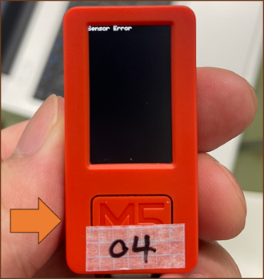

> [!TIP]
> **プログラムを再起動するタイミング：**
> - プログラムをアップロードした直後
> - プログラムがうまく動かないとき
> - センサーの値が更新されないとき
> - 画面がフリーズしたとき

### ★参加者ミッション

1. 自分の割り当てられた番号も画面に表示できるように変更してください。
2. AIを使ってプログラムの構造を理解してください。

> [!TIP]
> **ヒント**:
> - コードの中に`M5.Lcd.println("Env Measure");`という行があります
> - この下に自分のデバイスID（自分の番号）を表示する行を追加してみましょう（DEVICE_IDを使用してください）
> - 例: `M5.Lcd.printf("No: %s\n", DEVICE_ID);`（5を自分の番号に変更）


---

## 4. lesson2: マイコンのUI作成

### 4.1. このレッスンで学ぶこと

lesson1をベースに、BME280から取得したデータをグラフで表示します。

### 4.2. 準備するもの
- M5StickC Plus
- BME280センサー
- USBケーブル

### 4.3. セットアップ手順

1. **ファイル > 開く**で`Arduino/lesson/lesson2/lesson2_M5StickC.ino`を開く
2. lesson1と同じように、**ボード**と**シリアルポート**を選択
3. **コンパイル**して、**アップロード**
4. M5StickCの画面に温度のグラフが表示されます

### 4.4. 動作確認

- 画面の上部に温度・湿度・気圧の数値が表示されます
- 画面の下部に温度のグラフが表示されます
- グラフは過去20個のデータポイントを表示します

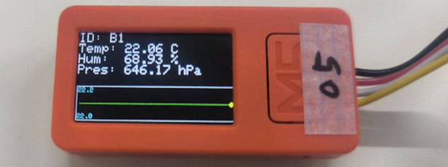

### ★参加者ミッション

最初は温度のグラフが表示されます。気圧や湿度のグラフを表示できるように変更してください。

> [!TIP]
> 1. コードの最後の方（`loop()`関数内）を探してください
> 2. `drawGraph(temp);`という行を見つけてください
> 3. この行を変更します：
>    - 気圧のグラフ: `drawGraph(pres);`
>    - 湿度のグラフ: `drawGraph(hum);`
> 4. 変更したら、コンパイルしてアップロードしてください

> [!IMPORTANT]
> 変更するときは、`drawGraph(temp);`の`temp`の部分だけを変更してください。`drawGraph();`はそのままにしてください。


---

## 5. lesson3: 無線通信をする（ESP-NOW）

### 5.1. このレッスンで学ぶこと

M5StickCからM5StackにBME280のデータをESP-NOWという無線通信で送信します。

### 5.2. 準備するもの
- M5StickC Plus（送信側）
- M5Stack（受信側）
- BME280センサー
- USBケーブル2本


### 5.3. セットアップ手順

#### 5.3.1. パート1: ゲートウェイ（受信側：M5Stack）の設定

1. **ファイル > 開く**で`Arduino/lesson/lesson3/lesson3_M5Stack.ino`を開く
2. **ツール > ボード > esp32**で「**M5Stack-Core-ESP32**」を選択
   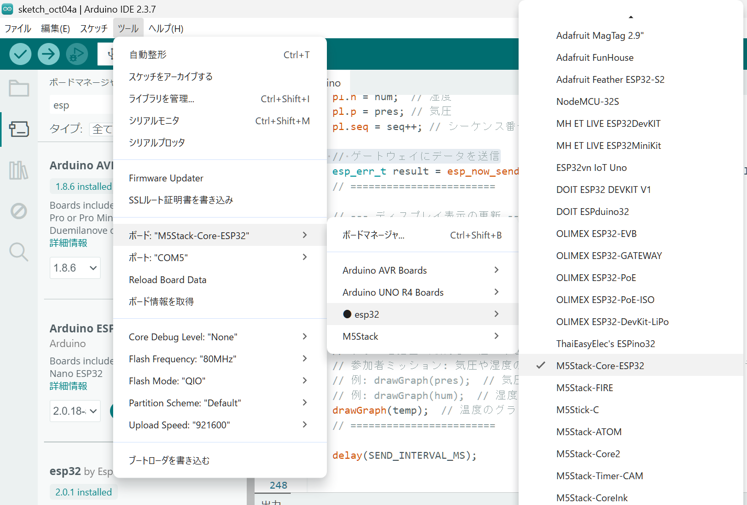
3. **ツール > シリアルポート**でM5Stackのシリアルポートを選択（※COM3などが表示されるが、人によって異なります）

4. **コンパイル**して、**アップロード**
5. **ツール > シリアルモニター**を開く（ボーレート: 115200）
6. シリアルモニターに表示される**MACアドレス**をメモしてください
   - 例: `98:f4:ab:6c:e7:88`
   - このMACアドレスは後で使います

> [!TIP] シリアルモニターとは
> **シリアルモニター**は、Arduino IDEに搭載されているツールで、マイコン（M5StackやM5StickC Plus）から送られてくるデータを表示する画面です。
> 
> **主な使い方：**
> - マイコンが送信したデータ（文字や数字、JSON形式のデータなど）がリアルタイムで表示されます
> - プログラムの動作を確認したり、デバッグ（エラーを探す）するときに便利です
> - このレッスンでは、M5Stackから送られてくるMACアドレスやセンサーデータを確認するために使用します
> 
> **開き方：**
> - Arduino IDEのメニューから **ツール > シリアルモニター** を選択
> - または、ショートカットキー `Ctrl+Shift+M`（Windows）/ `Cmd+Shift+M`（Mac）で開けます
> 
> **注意点：**
> - シリアルモニターを開くときは、**ボーレート（通信速度）を115200に設定**する必要があります
> - シリアルモニターが開いている間は、他のアプリケーション（Pythonスクリプトなど）が同じシリアルポートを使用できません

**シリアルモニターでMACアドレス確認**
- シリアルモニターの画面で`{"type":"gateway_boot","channel":1,"mac":"98:f4:ab:6c:e7:88"}`のようなJSONが表示されているので、"mac":の後の英数字がMACアドレスです。
- またはM5Stackの画面上にも表示されます。

#### 5.3.2. パート2: 送信側（M5StickC）の設定

1. **ファイル > 開く**で`Arduino/lesson/lesson3/lesson3_M5StickC.ino`を開く
2. **ツール > ボード**で「**M5StickC Plus**」を選択
3. **ツール > シリアルポート**でM5StickCのシリアルポートを選択

4. **コードを変更**します。以下の部分を見つけて変更してください：

   ```c
   // ゲートウェイのMACアドレスを設定
   uint8_t GATEWAY_MAC[6] = {0x98, 0xf4, 0xab, 0x6c, 0xe7, 0x88};  // ← ここを変更
   ```
   
   **変更方法**:
   - パート1でメモしたMACアドレスを確認
   - 例: `98:f4:ab:6c:e7:88`の場合
   - `{0x98, 0xf4, 0xab, 0x6c, 0xe7, 0x88}`に変更
   - `0x`はそのまま、数字の部分だけをMACアドレスに合わせて変更
   - 注意: MACアドレスの区切り文字（`:`）は無視して、数字だけを`0x`付きで並べます

   ```c
   // デバイスID（自分の番号）を設定
   const char DEVICE_ID[] = "XX";  // ← 自分のIDに変更
   ```
   
   **変更方法**:
   - `"XX"`の部分を自分のIDに変更
   - 例: `"A1"`, `"A2"`, `"B2"`など

5. **コンパイル**して、**アップロード**

#### 5.3.3. パート3: 動作確認

1. M5StickCの画面にデバイスID（自分の番号）やセンサーの値、送信状態が表示されます
2. M5StackのシリアルモニターにJSON形式のデータが表示されます
   - 例: `{"type":"sample","id":"B1","t":25.30,"h":55.20,"p":1013.25,"seq":123,"from":"98:f4:ab:6c:e7:88"}`

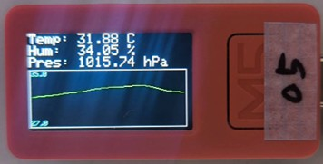

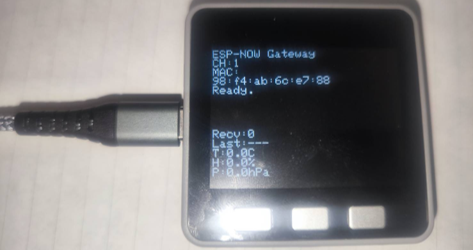

### ★参加者ミッション

ESP-NOWの無線通信部分がどこにあるか学習してください。

> [!TIP]
> **確認する場所**:
> - `setup()`関数内: `esp_now_init()` - ESP-NOWの初期化
> - `loop()`関数内: `esp_now_send()` - データの送信
> - `OnDataSent()`関数: 送信完了したときに呼ばれる関数

---

## 6. lesson4: マイコンのUI作成（M5Stack側）

### 6.1. このレッスンで学ぶこと

M5Stack側でESP-NOWで受信したデータをグラフ表示します。

### 6.2. 準備するもの

- M5StickC Plus（送信側）
- M5Stack（受信側）
- BME280センサー
- USBケーブル2本

### 6.3. セットアップ手順

1. lesson3のパート1と同じように、M5Stackに`Arduino/lesson/lesson4/lesson4_M5Stack.ino`をアップロードしてください。
2. lesson3のパート2と同じように、M5StickCに`Arduino/lesson/lesson3/lesson3_M5StickC.ino`をアップロード(lesson3からの変更はしなくてよいです)

### 6.4. 動作確認

- M5Stackの画面に温度のグラフが表示されます
- 受信したデータ数や最後に受信したデバイスID（自分の番号）が表示されます

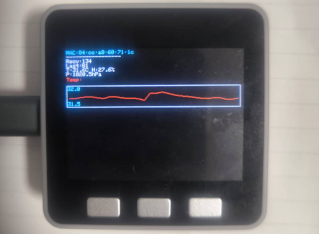

### ★参加者ミッション

最初は温度だけのグラフが表示されます。気圧も湿度も一緒に表示できるように変更してください。

> [!TIP]
> 1. `loop()`関数内のグラフ描画部分を探してください
> 2. 温度のグラフを描画している部分を見つけます：
>    ```c
>    drawGraphWithLabel(tempHistory, RED, "Temp:", graphYOffset);
>    graphYOffset += GRAPH_HEIGHT + 20;
>    ```
> 3. この下に、湿度と気圧のグラフを追加します：
>    ```c
>    // 湿度のグラフを追加
>    drawGraphWithLabel(humHistory, BLUE, "Humidity:", graphYOffset);
>    graphYOffset += GRAPH_HEIGHT + 20;
>
>    // 気圧のグラフを追加
>    drawGraphWithLabel(presHistory, GREEN, "Pressure:", graphYOffset);
>    graphYOffset += GRAPH_HEIGHT + 20;
>    ```
>
> 4. 変更したら、コンパイルしてアップロードしてください


---

## 7. lesson5: PCとの接続（Python）

### 7.1. このレッスンで学ぶこと

M5StackからPythonにシリアル通信でデータを取得します。

### 7.2. 準備するもの

- M5StickC Plus（送信側）
- M5Stack（受信側）
- BME280センサー
- USBケーブル2本
- PythonがインストールされたPC

### 7.3. セットアップ手順

1. lesson3のパート1と同じように、M5Stackに`Arduino/lesson/lesson5/lesson5_M5Stack.ino`をアップロード
2. lesson3のパート2と同じように、M5StickCに`Arduino/lesson/lesson3/lesson3_M5StickC.ino`をアップロード(レッスン3から変更しなくてよいです)
3. M5StackをUSBケーブルでPCに接続
4. シリアルポート番号を確認: シリアルポート（WindowsではCOMポート）はM5Stack（灰色の大きいマイコン）のシリアルポートを指定してください。
   - Windows: デバイスマネージャーで「COM5」など
   - Mac: ターミナルで`ls /dev/tty.*`を実行
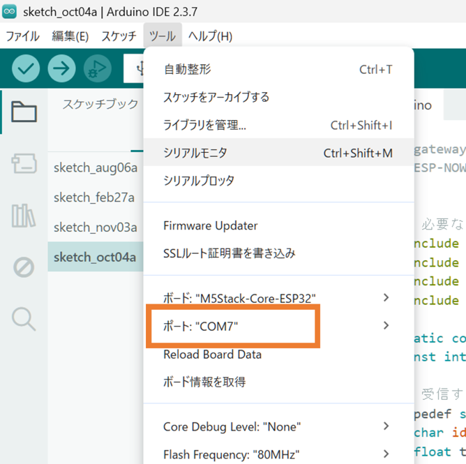

上記の**ツール > シリアルモニター**を選択するとシリアル通信をすることができます。

### 7.4. VSCodeでのPythonデータ取得

このセクションでは、VSCodeのターミナルを使ってPythonスクリプトを実行し、M5Stackからデータを取得する方法を詳しく説明します。

#### 7.4.1. ステップ1: VSCodeでプロジェクトを開く

1. Visual Studio Codeを起動したら、**ファイル > フォルダーを開く**をクリック
2. [1.3. 準備するプログラム](#13-準備するプログラム)でダウンロード・展開したフォルダ内の`python`フォルダを選択
3. **フォルダーの選択**をクリック

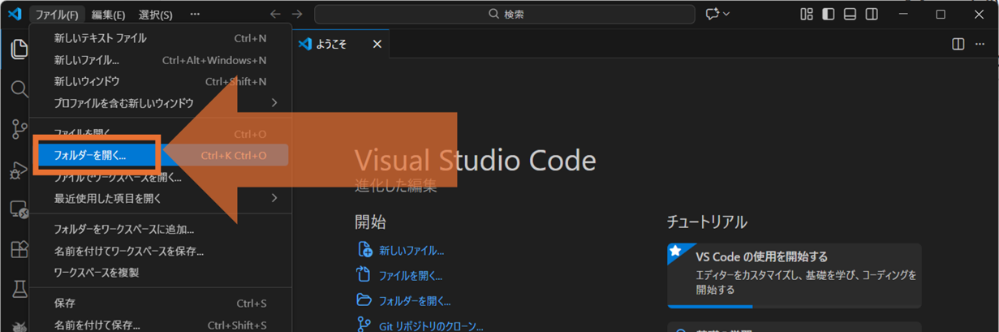

> [!TIP]
> フォルダのパス例: `デスクトップ\M5Stack-BME280-ESPNOW-main\python`

#### 7.4.2. ステップ2: ターミナルを開く

VSCodeでターミナルを開く方法は3つあります：

**方法1: メニューから開く**
- **ターミナル > 新しいターミナル** をクリック

**方法2: ショートカットキーを使う**
- Windows: `Ctrl + Shift + @`（日本語キーボードでは `Ctrl + Shift + @`）
- Mac: `Cmd + Shift + @`

**方法3: 画面上部のアイコンから開く**


ターミナルが開くと、VSCodeの下部にコマンド入力エリアが表示されます。


**確認方法:**
- コマンド実行後、ターミナルのパスに`python`が含まれていることを確認
- 例: `C:\デスクトップ\My project\M5Stack-BME280-ESPNOW\python>`

#### 7.4.4. ステップ4: Pythonスクリプトを実行

シリアルポート（WindowsではCOMポート）はM5Stack（灰色の大きいマイコン）のシリアルポートを指定してください。

**Windowsの場合:**
```bash
python lesson5.py --port COM5
```
**COM5**の部分を自分のシリアルポート番号に変更してください（例: COM3, COM4, COM7など）
- シリアルポート番号がわからない場合は、Arduino IDEの**ツール > シリアルポート**で確認できます

**macOS/Linuxの場合:**
```bash
python lesson5.py --port /dev/tty.usbserial-xxxx
```
**xxxx**の部分を自分のシリアルポート番号に変更してください
- シリアルポート番号がわからない場合は、ターミナルで`ls /dev/tty.*`を実行して確認できます

**シリアルポート番号の確認方法:**
- Windowsの場合: デバイスマネージャーで確認
- macOS/Linuxの場合: ターミナルで `ls /dev/tty.*` を実行

> [!IMPORTANT] 
> **要チェック:**
> - コマンド入力後、Enterキーを押して実行
> - エラーが出た場合は、シリアルポート番号が正しいか確認
> - 他のアプリケーション（Arduino IDEのシリアルモニターなど）がシリアルポートを使用していないか確認
> - Pythonがインストールされていない場合は、エラーメッセージが表示されます。その場合は[1. 必要な環境の準備](#1-必要な環境の準備)を確認してください

> [!TIP] 
> Pythonプログラムの停め方
>
> Pythonスクリプト（`lesson5.py`や`lesson6.py`など）を実行中にプログラムを停止したい場合は、以下の手順で停止できます：
> 
> **停止方法：**
> 1. VSCodeのターミナルウィンドウをクリックして、ターミナルにフォーカスを当てます
> 2. **Ctrl + C**（Windows）/ **Cmd + C**（Mac）を押します
> 3. プログラムが停止し、ターミナルに制御が戻ります
> 
> **注意点：**
> - プログラムを停止すると、データの取得やグラフの表示が終了します
> - 再度実行する場合は、同じコマンド（例: `python lesson5.py --port COM5`）を実行してください

#### 7.4.5. データの確認

実行が成功すると、ターミナルに以下のようなJSON形式のデータが表示されます：

```json
{"type":"sample","id":"B1","t":25.30,"h":55.20,"p":1013.25,"seq":123,"from":"98:f4:ab:6c:e7:88"}
```

**データの見方:**
- `id`: デバイスID（自分の番号）（例: B1）
- `t`: 温度（°C）
- `h`: 湿度（%RH）
- `p`: 気圧（hPa）
- `seq`: シーケンス番号

### ★参加者ミッション

1. シリアル通信について学んでください。シリアルポート（WindowsではCOMポート）の設定が人によって違うことを学習しましょう。
2. AIを使ってプログラムの構造を理解してください。

> [!TIP]
> - WindowsとmacOS/Linuxでシリアルポート名の形式が異なる
>   - Windows: `COM5`, `COM7`など
>   - Mac/Linux: `/dev/tty.usbserial-xxxx`など
> - ボーレート（115200）が一致している必要がある
> - 他のアプリケーションがシリアルポートを使用していないか確認
> **便利なショートカットキー（コード編集時）：**
> - **コピー**: `Ctrl + C`（Windows）/ `Cmd + C`（Mac）
> - **貼り付け**: `Ctrl + V`（Windows）/ `Cmd + V`（Mac）
> - **保存**: `Ctrl + S`（Windows）/ `Cmd + S`（Mac）
> - コードを編集する際に覚えておくと便利です

---

## 8. lesson6: PythonでUIを作成

### 8.1. このレッスンで学ぶこと

シリアル通信で取得したデータをPythonでグラフ化します。

### 8.2. 準備するもの
- M5StickC Plus（送信側）
- M5Stack（受信側）
- BME280センサー
- USBケーブル2本
- PythonがインストールされたPC

### 8.3. セットアップ手順

1. lesson5と同様に、M5StackをPCに接続
2. VSCodeを起動し、今回の講義のフォルダ（`M5Stack-BME280-ESPNOW`）を開く
3. ターミナルを開いて、`python`フォルダに移動
4. Pythonスクリプトを実行：

**Windowsの場合:**
```bash
python lesson6.py --port COM5
```
**COM5**の部分を自分のシリアルポート番号に変更してください

**macOS/Linuxの場合:**
```bash
python lesson6.py --port /dev/tty.usbserial-xxxx
```
**xxxx**の部分を自分のシリアルポート番号に変更してください

> **💡 VSCodeターミナルの使い方がわからない場合**
> 
> [lesson5のVSCodeでのPythonデータ取得](#74-vscodeでのpythonデータ取得)のセクションを参照してください。
> ターミナルの開き方、`cd python`コマンドの実行方法、シリアルポート番号の確認方法など、詳しく説明しています。
### 8.4. 動作確認

- Pythonのウィンドウにグラフが表示されます
- リアルタイムでデータが更新されます
- 温度、湿度、気圧の3つのグラフが表示されます

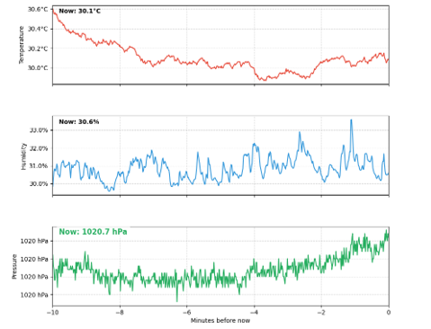

### ★参加者ミッション

AIを使って、以下のように3つのグラフを一つのグラフに3つのデータが表示されるコードを作成してください。今回はマイクロソフトのEdgeを使ってください。ChatGPTを使ってください。

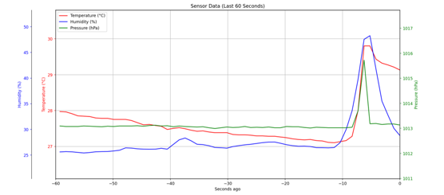

> [!TIP]
> **📋 参考プロンプト例**
>
> 以下のプロンプトを参考にAIに送信してください。既存のコードとJSONファイルの形式を含めています。
> ```
> pyserialを使ってシリアルポートからJSONデータを読み取り、
> matplotlibでリアルタイムグラフを表示するPythonスクリプトを作成してください。
> 
> 【JSONファイルの形式】
> シリアルポートから以下の形式のJSONが1行ずつ送信されます：
> 
> 1. ゲートウェイ起動時:
> {"type":"gateway_boot","channel":1,"mac":"98:f4:ab:6c:e7:88"}
> 
> 2. センサーデータ（1秒ごと）:
> {"type":"sample","id":"B1","t":25.30,"h":55.20,"p":1013.25,"seq":123,"from":"98:f4:ab:6c:e7:88"}
> 
> 各フィールドの説明:
> - type: "sample"（センサーデータ）または"gateway_boot"（起動メッセージ）
> - id: デバイスID（自分の番号）（例: "A1", "B1", "C2"など）
> - t: 温度（°C、float）
> - h: 湿度（%RH、float）
> - p: 気圧（hPa、float）
> - seq: シーケンス番号（uint32）
> - from: 送信元のMACアドレス（文字列）
> 
> 【既存のコード】
> 以下の既存コードを参考にしてください：
> 
> # python/lesson6.py
> import argparse
> import json
> import time
> from collections import defaultdict
> from dataclasses import dataclass
> from typing import Dict, List
> 
> import matplotlib.pyplot as plt
> import matplotlib.animation as animation
> import serial
> 
> @dataclass
> class DataPoint:
>     t: float  # 温度
>     h: float  # 湿度
>     p: float  # 気圧
>     timestamp: float  # 受信時刻
> 
> device_data: Dict[str, List[DataPoint]] = defaultdict(list)
> MAX_HISTORY = 100
> 
> fig, axes = plt.subplots(3, 1, figsize=(12, 8))
> axes[0].set_title("Temperature (°C)", fontsize=12)
> axes[1].set_title("Humidity (%)", fontsize=12)
> axes[2].set_title("Pressure (hPa)", fontsize=12)
> 
> def main():
>     parser = argparse.ArgumentParser()
>     parser.add_argument("--port", required=True, help="Windows例: COM5 / macOS例: /dev/tty.usbserial-xxxx")
>     parser.add_argument("--baud", type=int, default=115200)
>     args = parser.parse_args()
>     
>     ser = serial.Serial(args.port, args.baud, timeout=0.2)
>     # ... 以下を実装してください
> 
> 【要件】
> 1. 一つのデバイスから送信されるデータを時系列グラフで表示
> 2. サブプロットに分けず、1つのAxes（グラフエリア）に温度湿度気圧全ての線を表示すること。
> 3. 各値(温度湿度気圧)ごとに異なる色でプロット
> 4. リアルタイムで更新（1秒ごと）
> 5. 過去10分間のデータを表示
> 6. コマンドライン引数でシリアルポート番号を指定可能
> 7. 横軸（X軸）は「現在から何分前か」の相対時間（過去10分間分）を表示すること
> 【実装のポイント】
> - pyserialでシリアルポートを開く
> - JSONをパースしてtype="sample"のデータを処理
> - デバイスごとにデータ履歴を保持
> - matplotlib.animationでリアルタイム更新
> - エラーハンドリング（JSONパースエラー、シリアルポートエラーなど）
> ```
>
> 💡 **使い方**: このプロンプトをAIに送信すると、既存のコードとJSON形式を理解した上で、適切なPythonスクリプトを生成してくれます。

---

## 9. lesson7: 参加者で共同作品

### 9.1. このレッスンで学ぶこと

各自のM5StickCのチャンネルを一つに合わせて、室内の温度マップを作成します。

### 9.2. 準備するもの

- M5StickC Plus（各参加者）
- M5Stack（ゲートウェイ用、1台）
- BME280センサー（各参加者）
- USBケーブル

### 9.3. セットアップ手順

#### 9.3.1. M5StickCの設定

1. **ファイル > 開く**で`Arduino/lesson/lesson3/lesson3_M5StickC.ino`を開く
2. **ツール > ボード**で「**M5StickC Plus**」を選択

3. **全員が同じ値**に設定する部分：
   ```c
   // 全員が同じチャンネルに設定
   const int CHANNEL = 1;  // ★講師から指定されたチャンネル番号に変更★
   
   // ゲートウェイのMACアドレス（全員同じ）
   uint8_t GATEWAY_MAC[6] = {0x98, 0xf4, 0xab, 0x6c, 0xe7, 0x88};  // 実際のMACアドレスに変更
   ```
   - `CHANNEL`: 講師から指定された番号に変更
   - `GATEWAY_MAC`: 講師から指定されたMACアドレスに変更（lesson3と同じ方法）

4. **各自の座席番号**に合わせて設定：
   ```c
   // 自分の座席番号に変更
   const char DEVICE_ID[] = "B1";  // ★自分の座席番号に変更★
   ```
   - `"B1"`の部分を自分の座席番号に変更
   - 例: `"A1"`, `"A2"`, `"B2"`, `"C3"`など

4. **コンパイル**して、**アップロード**

#### 9.3.2. M5Stack（ゲートウェイ）の設定

1. lesson3のパート1と同じように、M5Stackに`Arduino/lesson/lesson5/lesson5_M5Stack.ino`をアップロードしてください
2. M5StackをPCに接続して、Pythonスクリプトを実行してください

### 9.4. 動作確認

- 各参加者のM5StickCから送信されたデータがM5Stackで受信されます
- PC側で温度マップが表示されます

## 10. 発展編

### 10.1. 別のセンサー（IMU）を使った開発をしよう

M5StickC Plusに初めから搭載されている**IMU（Inertial Measurement Unit：慣性計測装置）**を使って、デバイスの姿勢（傾き）を検出し、無線で送信してみましょう！

#### IMUとは？

**IMU（Inertial Measurement Unit）**は、加速度と角速度を測定するセンサーです。M5StickC Plusには**MPU6886**というIMUが搭載されており、以下のデータを取得できます：

- **加速度（Acceleration）**: X軸、Y軸、Z軸方向の加速度
  - 単位: m/s²（メートル毎秒毎秒）
  - デバイスを動かすと値が変化します
- **ジャイロ（Gyroscope）**: X軸、Y軸、Z軸周りの回転速度
  - 単位: °/s（度毎秒）
  - デバイスを回転させると値が変化します

**IMUの応用例：**
- デバイスの傾きを検出して、画面の向きを自動で変更
- ジェスチャー認識（振る、回すなどの動作を検出）
- 姿勢制御（ドローンやロボットのバランス制御）
- ゲームのコントローラー（Wiiリモコンのような操作）

#### このセクションで学ぶこと

lesson1からlesson6で学んだBME280センサーの代わりに、IMUセンサーを使って以下のステップで開発を進めます：

> [!TIP]
> **開発のステップ：**
> 
> **ステップ1: IMUデータの取得**
> - BME280の代わりにM5StickC Plusに搭載されているIMUのデータを取得できるようにコードを修正します
> - 加速度（X, Y, Z）とジャイロ（X, Y, Z）の6つの値を取得します
> - シリアルモニターや画面に表示して、デバイスを動かしたときの値の変化を確認します
> 
> **ステップ2: IMUデータのグラフ化**
> - lesson2を参考に、取得したIMUのデータをグラフ化してみましょう
> - 加速度とジャイロの値を時系列で表示します
> - デバイスを動かしたときのグラフの変化を観察します
> 
> **ステップ3: 無線通信でIMUデータを送信**
> - lesson3を参考に、取得したIMUのデータを無線でM5Stackに飛ばして、グラフ化してみましょう
> - ESP-NOWを使って、加速度とジャイロのデータを送信します
> - M5Stack側で受信したデータをグラフ表示します
> 
> **ステップ4: PC（Python）で3D姿勢を可視化**
> - lesson5, lesson6を参考に、PC（Python）と接続して、四角いオブジェクト（3Dモデル）の姿勢を操作できるようにしましょう
> - 取得したIMUデータから、デバイスの姿勢（傾き）を計算します
> - 3Dグラフィックスライブラリ（matplotlibの3D機能など）を使って、リアルタイムで3Dオブジェクトの姿勢を表示します
> - M5StickC Plusを傾けると、画面上の3Dオブジェクトも同じように傾きます

**参考コードの場所：**
- M5StickC PlusのIMUを使う場合は、`M5.Imu.getImuData()`関数を使用します
- 詳細はM5StickCPlusライブラリのドキュメントを参照してください

### 10.2. オンライン化（Google Spread Sheet）

lesson5やlesson6で取得したセンサーデータを、Google Spread Sheetに自動で記録して、オンラインで共有・可視化できるようにしてみましょう。

**このセクションで学ぶこと：**
- Google Spread Sheet APIを使ったデータの自動記録
- 複数の参加者のデータを一つのスプレッドシートに集約
- 時系列データの可視化と分析

**準備するもの：**
- Googleアカウント
- Python環境（lesson5, lesson6と同じ）
- インターネット接続

**実装の流れ：**
1. Google Cloud Platformでプロジェクトを作成し、APIを有効化
2. 認証情報（JSONキー）を取得
3. Pythonスクリプトを修正して、シリアル通信で取得したデータをGoogle Spread Sheetに書き込む
4. スプレッドシート上でグラフを作成して、リアルタイムでデータを可視化

> [!TIP]
> **参考手順：**
> 1. Google Cloud Platformで「Google Sheets API」と「Google Drive API」を有効化
> 2. サービスアカウントを作成して、JSONキーをダウンロード
> 3. 共有用のスプレッドシートを作成し、サービスアカウントに編集権限を付与
> 4. Pythonで`gspread`ライブラリを使用してデータを書き込む
> 5. スプレッドシート上でグラフを作成して、リアルタイムでデータの変化を確認

---

## よくあるエラーと解決方法

### エラー1: 「ボードが見つかりません」

**症状**: ボードの選択リストに「M5StickC Plus」や「M5Stack」が表示されない

**解決方法**:
1. ESP32ボードがインストールされているか確認
2. **ツール > ボード > ボードマネージャー**で「ESP32」を検索
3. インストールされていない場合は、[1. 必要な環境の準備](#1-必要な環境の準備)の手順に従ってインストール

### エラー2: 「シリアルポートが見つかりません」

**症状**: シリアルポートのリストが空、または接続できない

**解決方法**:
1. USBケーブルがデータ転送対応か確認（充電専用ケーブルでは接続できません）
2. USBケーブルを抜き差ししてみる
3. 他のアプリケーションがシリアルポートを使用していないか確認
4. デバイスマネージャー（Windows）でシリアルポートが認識されているか確認

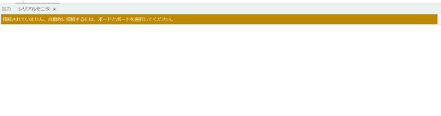

### エラー3: 「コンパイルエラー: 'M5StickCPlus' was not declared」

**症状**: コンパイル時にライブラリが見つからないエラー

**解決方法**:
1. **ツール > ライブラリを管理**で「M5StickCPlus」を検索
2. インストールされていない場合はインストール
3. インストール後、Arduino IDEを再起動


### エラー4: 「アップロードエラー: Failed to connect to ESP32」

**症状**: アップロード時に接続できない

**解決方法**:
1. USBケーブルが正しく接続されているか確認
2. M5StickC/M5Stackの電源が入っているか確認
3. シリアルポートが正しく選択されているか確認
4. アップロード時にM5StickC/M5Stackのリセットボタンを押してみる


### エラー5: 「BME280が見つかりません」

**症状**: シリアルモニターに「Could not find a valid BME280 sensor」と表示される

**解決方法**:
1. BME280の配線を確認
   - M5StickC Plus: SDA=32番ピン、SCL=33番ピン
2. BME280のI2Cアドレスを確認（デフォルト: 0x76）
3. コード内の`bme.begin(0x76, &Wire);`の`0x76`を`0x77`に変更してみる
### エラー6: 「データが受信されない」（lesson3, lesson7）

**症状**: 無線通信がうまくいかない

**解決方法**:
1. ゲートウェイと送信機の`CHANNEL`が一致しているか確認
2. 送信機の`GATEWAY_MAC`が正しいか確認
3. ESP-NOWの通信範囲内にいるか確認（通常10-50m）
4. シリアルモニターでゲートウェイが起動しているか確認


### エラー7: 「Pythonスクリプトがエラーになる」

**症状**: `python lesson6.py`を実行するとエラーが出る

**解決方法**:
1. 必要なライブラリがインストールされているか確認：
   ```bash
   pip install pyserial matplotlib numpy scipy
   ```
2. シリアルポート番号が正しいか確認
3. M5Stackが正しく接続されているか確認
4. 他のアプリケーション（Arduino IDEのシリアルモニターなど）がシリアルポートを使用していないか確認

---
